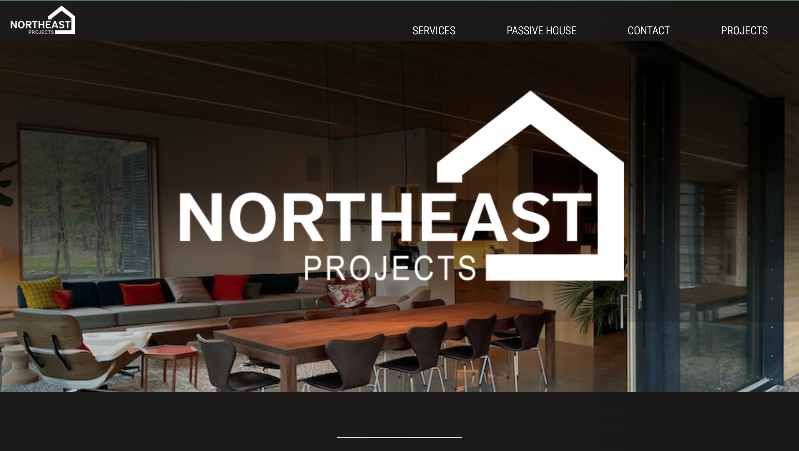
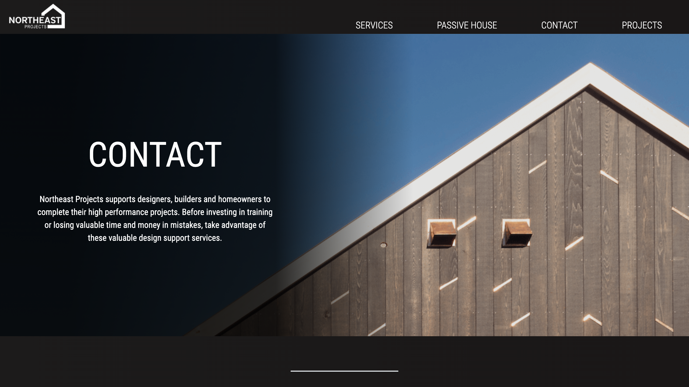
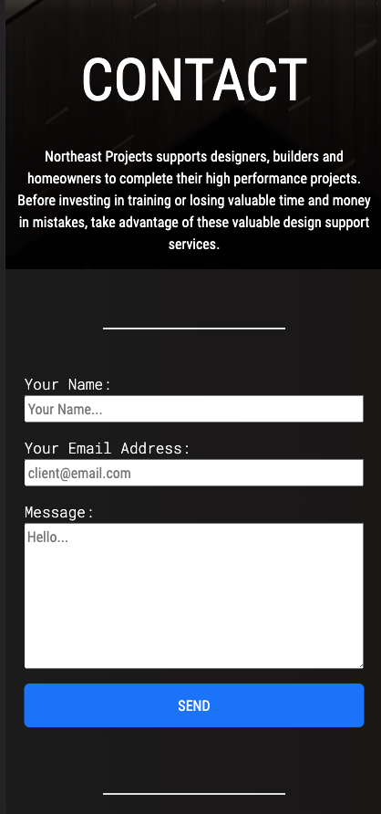
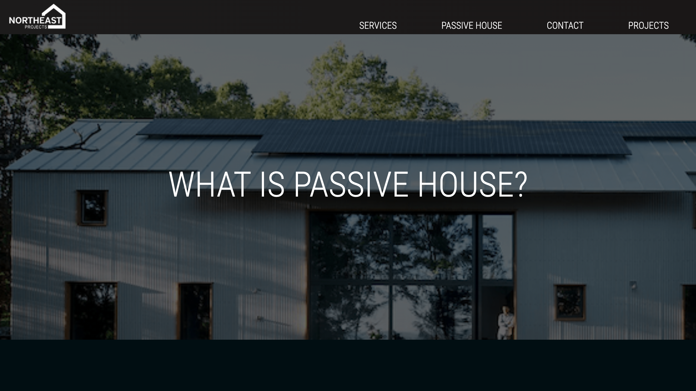
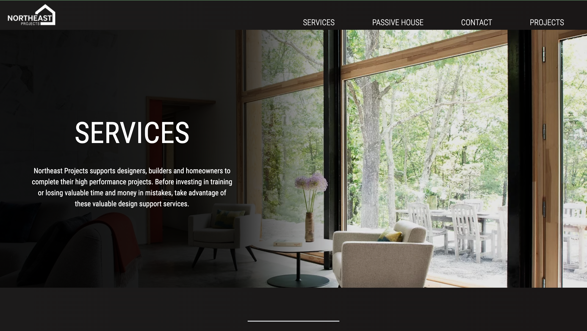

# Northeast Projects, llc

Business page for Northeast Projects, llc -- a Hudson Valley, NY based Passive House design company. The website is mobile responsive for ease of use on the go. 

## Technologies Used

*React.js
*Google Fonts
*React Router
*React Bootstrap
*HTML
*CSS
*JavaScript
*EmailJS
*Framer 

## Screenshots

## Link to deployed site (v1)
https://mloercher.github.io/northeast_projects/

## Run Instructions

To run locally, clone repo and install all necessary packages by running an 'npm i' or 'yarn i' in terminal. To run app, enter command 'npm start' or 'yarn start' in terminal. 
